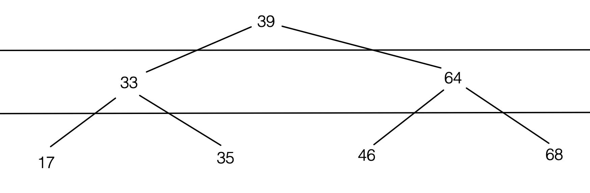

# Trees and Graphs
## Trees
A tree is a data structure that consists of data nodes, where each node has exactly 1 direct parent (except for the _root node_, which has no parent). Any node in the tree can have any number of children.

Some common uses of trees are:
1. A file system: every file/folder is a node. A folder can have any number of children nodes inside it, but each node can only have 1 direct parent folder.
1. The html DOM: every tag is a node. Any tag can have any number of children inside it, but each tag can only have 1 direct parent tag.

### Analyzing our trees
1. A node is called a _leaf node_ if it has no children.
1. The whole tree can have a "depth/height", and each node can also have these measurements. See https://stackoverflow.com/questions/2603692/what-is-the-difference-between-tree-depth-and-height. Note that some textbooks will define the root node as having depth 0 (ie counting depth by edges), and others will define the root node as having depth 1 (ie counting depth by nodes). When in doubt (ie with an interviewer), it is always a good idea to clarify!
1. Sometimes we want to consider a _subtree_. This is done by choosing a node (usually somewhere in the middle of the tree), and restricting our focus to nodes that descend from that node.

### (Restricted) Trees
There are certain restrictions that we can put on trees that make them super useful for specific applications.

1. In a _binary tree_, each node has exactly 2 children (unless it's a leaf, in which case it has 0).
1. In a _binary search tree_, in addition to having either 2 or 0 nodes, every node has a left-hand child with a smaller value, and a right-hand child with a bigger value. This data structure is optimized to perform binary searches.

Take a look at this BST and think about how you would find any given element in it using the same logic as a binary search.

### Balancing binary search trees
A BST is _balanced_ if:
1. The height of the overall tree is no greater than it has to be in order to hold its number of nodes. Tabulate how many nodes can be held in a tree of height 1, 2, 3, etc.
1. When you measure the depth of all the leaves, the greatest depth is only 1 bigger than the least depth.

Let's explore some different ways our sample tree could be unbalanced, and how we could fix them.

### Application of BSTs
The major application of BSTs is creating database indexes. When you have a column that you know you'll want to read from often (ie `SELECT * FROM myTable WHERE email = ?`), you can _index_ that column, which means that postgres creates a behind-the-scenes BST for the values in that column. This speeds up queries based on that column from O(n) to O(log(n)).

But what happens when we insert a new value into these index trees? In order to preserve all the rules of the BST (2 children, smaller children on the left and bigger children on the right, minimum height for how many nodes you have, maximum leaf depth difference is 1), the tree must be _rebalanced_. (Take a minute to think about how this would be done?) This adds a little bit of time onto the insertion process, but the payoff is that it speeds up the search process. Therefore, indexing is not to be done on every single column of every single table, just the ones that you expect to query often.

## Graphs
A graph is a data structure made up of nodes, where every node can be connected to any number of other nodes. There's no concept of parent or child, so it's kinda like an anything-goes no-rules tree.

In a graph, each node stores a list of which other nodes it's connected to. Let's build a graph together to store data on our past teams for group projects. In doing so, we'll learn about _directed_ and _undirected_ graphs.

The most common use of graphs is in databases where each row is connected to many other rows, like social media applications. In fact, there's an entirely different kind of database language called graphQL, and the big social media APIs are powered by it.